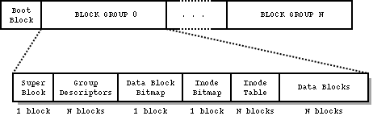
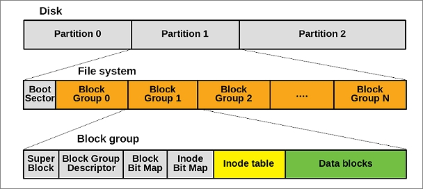

# The ext2 File System

## Overview

ext2 (Second Extended Filesystem) is a traditional Unix-style disk file system developed for Linux in 1993. It was the default Linux filesystem for many years before being superseded by ext3/ext4 (which added journaling). Understanding ext2 is foundational because ext3 and ext4 are backward-compatible extensions of it.

ext2 has no journal — it relies on `fsck` to recover after crashes. This makes it simpler to understand and fast for writes, at the cost of slow recovery after unclean shutdowns.

---

## Disk Layout

An ext2 volume is divided into fixed-size **blocks** (commonly 1 KiB, 2 KiB, or 4 KiB). Blocks are grouped into **block groups**, each of which contains a redundant copy of metadata.





Each block group has the same internal layout:



<!-- ```
Block 0    : boot / unused reserved block
Block 1    : superblock
Block 2    : block group descriptor table
Block 3    : block bitmap
Block 4    : inode bitmap
Blocks 5-20: inode table
             128 inodes × 128 bytes each = 16384 bytes = 16 blocks
Block 21   : root directory data block
Block 22   : lost+found directory data block
Block 23   : hello-world file data block
Blocks 24-1023: free data blocks
``` -->

| Region               | Purpose                                              |
|----------------------|------------------------------------------------------|
| Superblock           | Global FS metadata (block size, inode count, magic)  |
| Group Descriptor     | Per-group metadata (bitmap locations, free counts)   |
| Block Bitmap         | 1 bit per block — 1 = used, 0 = free                 |
| Inode Bitmap         | 1 bit per inode — 1 = used, 0 = free                 |
| Inode Table          | Array of fixed-size inode structures                 |
| Data Blocks          | Actual file/directory contents                       |

The superblock and group descriptor table are replicated in every (or every other) block group for redundancy.

---

## The Superblock

Located at byte offset 1024 from the start of the volume. Key fields:

| Field                  | Description                                   |
|------------------------|-----------------------------------------------|
| `s_inodes_count`       | Total inodes in the FS                        |
| `s_blocks_count`       | Total blocks in the FS                        |
| `s_free_blocks_count`  | Currently free blocks                         |
| `s_free_inodes_count`  | Currently free inodes                         |
| `s_first_data_block`   | First data block (0 for 4K blocks, 1 for 1K)  |
| `s_log_block_size`     | Block size = 1024 << s_log_block_size         |
| `s_blocks_per_group`   | Blocks per block group                        |
| `s_inodes_per_group`   | Inodes per block group                        |
| `s_magic`              | Must be `0xEF53`                              |
| `s_state`              | 1 = clean, 2 = errors                         |

---

## Inodes

Every file, directory, symlink, and device is represented by an **inode**. The inode stores metadata and pointers to data blocks, but NOT the filename (names live in directory entries).

Key inode fields:

| Field          | Description                                           |
|----------------|-------------------------------------------------------|
| `i_mode`       | File type and permissions (rwxrwxrwx + type bits)     |
| `i_uid`        | Owner user ID                                         |
| `i_gid`        | Owner group ID                                        |
| `i_size`       | File size in bytes                                    |
| `i_links_count`| Hard link count (inode is freed when this hits 0)     |
| `i_blocks`     | Number of 512-byte sectors allocated (not FS blocks)  |
| `i_atime`      | Last access time                                      |
| `i_mtime`      | Last modification time                                |
| `i_ctime`      | Last inode change time                                |
| `i_block[15]`  | Block pointers (see below)                            |

### Block Pointers (i_block[15])

ext2 uses a classic multi-level indirection scheme:

```text
i_block[0..11]   — 12 direct block pointers
i_block[12]      — single indirect: points to a block of block pointers
i_block[13]      — double indirect: points to a block of single-indirect blocks
i_block[14]      — triple indirect: points to a block of double-indirect blocks
```

For a 4 KiB block size, each indirect block holds 4096/4 = **1024 pointers**.

| Level           | Max addressable data                           |
|-----------------|------------------------------------------------|
| Direct (12)     | 12 × 4 KiB = 48 KiB                           |
| Single indirect | 1024 × 4 KiB = 4 MiB                          |
| Double indirect | 1024² × 4 KiB = 4 GiB                         |
| Triple indirect | 1024³ × 4 KiB = 4 TiB (capped by 32-bit size) |

The practical ext2 max file size with 4 KiB blocks is ~2 TiB (limited by the 32-bit `i_size` field, extended to 64-bit in large-file variants).

---

## Directories

A directory is just a file whose data blocks contain a sequence of **directory entries** (`struct ext2_dir_entry`):

```text
[ inode (4B) | rec_len (2B) | name_len (1B) | file_type (1B) | name (variable) ]
```

| Field       | Description                                              |
|-------------|----------------------------------------------------------|
| `inode`     | Inode number of the referenced file (0 = deleted)        |
| `rec_len`   | Bytes to the next entry (allows skipping deleted ones)   |
| `name_len`  | Length of the name string                                |
| `file_type` | 1=regular, 2=dir, 7=symlink, etc.                        |
| `name`      | File name (NOT null-terminated, length given by name_len)|

Entries are **not sorted**. Linear scan is required to look up a name. Each entry is padded to a 4-byte boundary. The last entry in a block has `rec_len` reaching the end of the block.

Every directory always has two special entries:

- `.`  — points to the directory's own inode
- `..` — points to the parent directory's inode

---

## Hard Links vs Soft Links

**Hard link**: a directory entry pointing to an existing inode. Multiple directory entries can point to the same inode — `i_links_count` tracks this. The file data is freed only when `i_links_count` drops to 0 (and no process has it open).

**Symbolic link (symlink)**: a special file (`i_mode` type = `S_IFLNK`) whose data is the target path string. If the path fits in 60 bytes, it is stored directly in the `i_block` array (fast symlink) instead of allocating a data block.

---

## Allocation

**Block allocation**: the block bitmap is scanned for a 0 bit. ext2 tries to allocate blocks near the inode's block group (locality optimization).

**Inode allocation**: the inode bitmap is scanned. New directories are placed in the block group with the most free inodes; new files go in the same group as their parent directory.

---

## Special Inodes

| Inode # | Purpose                        |
|---------|--------------------------------|
| 1       | List of bad blocks             |
| 2       | Root directory `/`             |
| 3       | User quota                     |
| 4       | Group quota                    |
| 5       | Boot loader                    |
| 8       | Journal (ext3/ext4 only)       |
| 11      | First usable inode             |

---

## Key Differences from ext3/ext4

| Feature          | ext2       | ext3        | ext4             |
|------------------|------------|-------------|------------------|
| Journal          | No         | Yes         | Yes (improved)   |
| Max file size    | 2 TiB      | 2 TiB       | 16 TiB           |
| Max FS size      | 4 TiB      | 4 TiB       | 1 EiB            |
| Extents          | No         | No          | Yes              |
| Dir index (HTree)| Optional   | Optional    | Default          |
| Recovery speed   | Slow (fsck)| Fast        | Fast             |

---

## Reading the FS Manually

To explore an ext2 image:

```bash
# Mount it
sudo mount -o loop disk.img /mnt

# Dump superblock info
dumpe2fs disk.img | head -40

# Read a raw inode
debugfs -R "stat <inode_number>" disk.img

# List directory entries
debugfs -R "ls -l /" disk.img
```

In code (as in lab4), you read the superblock at offset 1024, locate block groups via the group descriptor table at block 1 (or block 2 for 1 KiB blocks), then walk inode tables and directory entries directly from the raw bytes.
